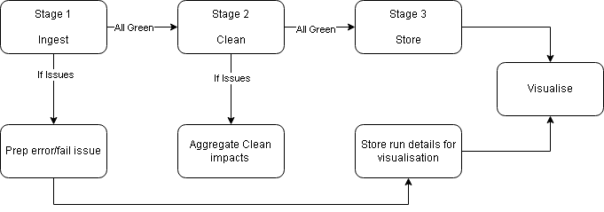
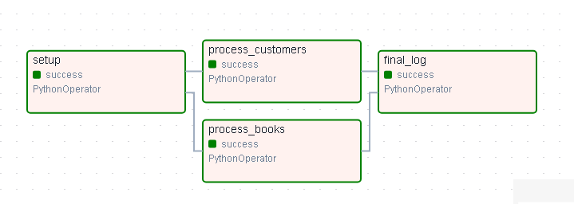
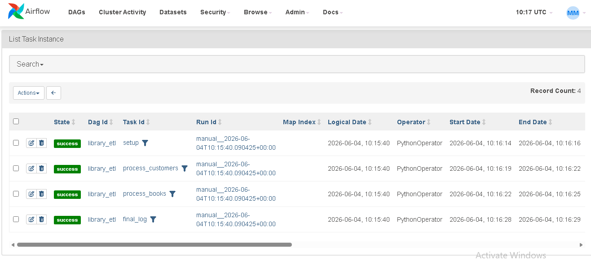

As a library admin I want to automaticvally ingest and clean the flat files I manually curate each day to impress my boss.

# How would I do it?

Stage 1 : ingestion
    - Needs a trigger/schedule
    - possible matching issues depenedant on src location
    - 1 master script or 1 for each type

Stage 2 : clean
    - Need to ID issues
    - Prepare for dirty dates, duplicates and text character errors
    - Enforce correct types for Dates and Integers
    - log all fixes and counts

Stage 3 : Store
    - Store outputs in DB
    - aggreagte fixes, create output of impacts / success/ fails etc

In addition:
    - Log activity at each stage (runtime, errors found etc)
    - Add logs to a DB for visualisation

To consider:
    - no current DE systems, new services will be expensive 
    - small bespoke management via scripts be cheaper but will add technical debt
 

    

# What I have Done

- Airflow used to manage pipeline
- Write transform functions for your data, then create a DAG() object with dag_id as the name in airflow, start and schedule ("@daily", "@hourly" or cron style)
- tags allow for grouping of processes

 - DAG class then runs each as a PythonOperator object with task_id and the function name.
 - Keep to 1 script per file, ensure unique naming 

